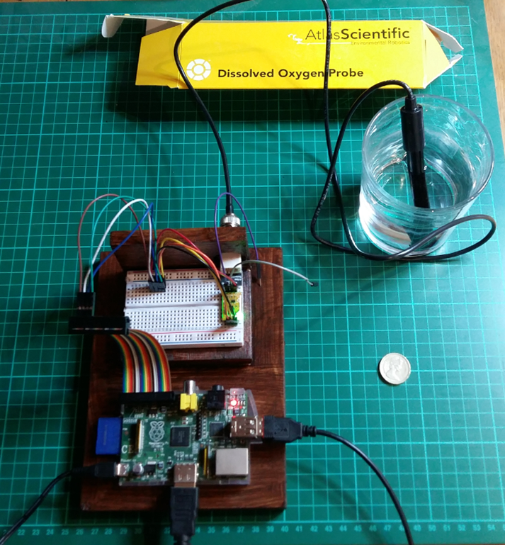
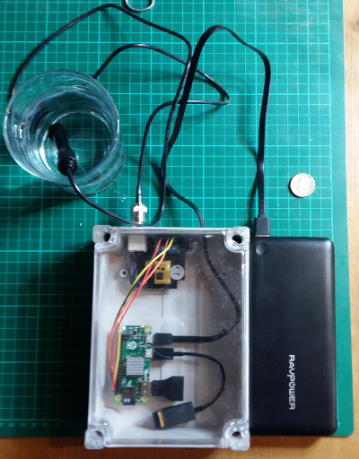

# do-project
Dissolved Oxygen sensor project tools and notes.

This repository contains notes and software developed as part of an MSc Group Project at Cranfield University.

We wanted to explore how Internet-of-Things techniques could be used to measure and monitor water quality in the Werrington Brook and
Cuckoo's Hollow in Peterborough.

We realised that Dissolved Oxygen is a key indicator of water quality and managed to use a DO Probe from Atlas Scientific, hooked up to a Raspberry PI, Microosft Azure IoT Hub and Stream Analyics.

## Parts List

[Dissolved Oxygen Probe](http://www.atlas-scientific.com/product_pages/probes/do_probe.html)

[Dissolved Oxygen Circuit](http://www.atlas-scientific.com/product_pages/circuits/ezo_do.html)

[Raspberry PI 1 Model B](https://www.raspberrypi.org/products/model-b/) and suitable power supply.
(Also works with a [Raspberry PI ZERO](https://www.raspberrypi.org/products/pi-zero/).

8 Gb SD Card

[USB Wifi Adapter for the Raspberry Pi](http://www.amazon.co.uk/USB-Wifi-Adapter-Raspberry-Pi/dp/B00EZOQFHO)

USB Keyboard

Assorted jumper leads

Plywood offcuts for a base board.

## The DO Probe

The DO Probe is a passive sensor, but generates a small voltage.

I put a digital voltmeter across the dissolved oxygen probe and noted
37.8mV about 5 minutes after dunking in tap water, removing and
leaving to dry.

## Assemble the components

[Instructables article](http://www.instructables.com/id/Plotly-Atlas-Scientific-Graph-Real-Time-Dissolved-/)
very useful for circuit, but a bit dated for Linux set up - see below instad.

Keep the connection between the BNC connector and the DO circuit board
as short as possible.

## Linux set up

Download [Raspbian](https://www.raspberrypi.org/downloads/)
2016-03-18-raspbian-jessie-lite and write it to an SD Card as per the
[instructions](https://www.raspberrypi.org/documentation/installation/installing-images/README.md).

Boot the Raspberry Pi

Check that the WiFi dongle is functional:

	sudo iwlist wlan0 scan

Add a section to "/etc/wpa_supplicant/wpa_supplicant.conf

	network={
		ssid="The_ESSID_from_earlier"
		psk="Your_wifi_password"
	}

Restart wlan0

	sudo ifdown wlan0
	sudo ifup wlan0
	
Then

	sudo apt-get update
	sudo apt-get upgrade
	sudo apt-get install python3
	sudo apt-get install python3-serial
	sudo apt-get install minicom
	sudo apt-get install git-core
	sudo apt-get install python3-pip

We don't want console fighting with our serial port, so disable it:

Debian now uses systemd, so:

	sudo systemctl stop serial-getty@ttyAMA0.service
	sudo systemctl disable serial-getty@ttyAMA0.service

Edit /boot/cmdline.txt and remove console=serial0,15200 

## Quick test with Minicom

Start minicom

	minicom -b 9600 -o -D /dev/ttyAMA0
	
Press CTRL-A then press Z, from the menu select A, Add a linefeed.

You can now type commands like STATUS etc. See the DO Circuit Data
Sheet for full list of commands. N.B. Factory reset doesn't seem to
work for me, but no matter.

## Tools

Use do-log.py to see if the Do circuit board is sending any data

	./do-log.py

If not, do-cont.py puts it into continuous mode:

	./do-cont.py
	
Use do-cal.py to calibrate the sensor (having dunked it in water then
let it dry out for 5 mins).

	./do-cal.py
	
The STATUS command, see do-status.py is useful for checking the
voltage level VCC.

	./do-status.py
	
## Azure

See [Azure IoT Hub Documentation](https://azure.microsoft.com/en-gb/documentation/services/iot-hub/)
and follow the instructions to create an IOT Hub./

You must have some form of Azure subscription. Although we're using
the free tier of the IOT Hub Service, its not included in the
DreamSpark offer, you need a pay as you go subscription even if you
don't spend any money.

Download and install
[SetupDeviceExplorer.msi](https://github.com/Azure/azure-iot-sdks/releases),
also see
[howto](https://github.com/Azure/azure-iot-sdks/blob/master/tools/DeviceExplorer/doc/how_to_use_device_explorer.md)

Use the Device Explorer utility to add a new device.

Plug the id and key into do-azure.py and run it

	./do-azure.py
	
https://github.com/bechynsky/AzureIoTDeviceClientPY

## Start at boot time

We use cron to start do-azure.py via a launcher.sh script.

	sudo crontab -e
	
Then add the following line:

	@reboot sh /home/pi/github/do-project/src/launcher.sh >/home/pi/github/do-project/logs/cronlog 2>&1

Make sure that you create the directory /home/pi/github/do-project/logs/

## Future Considerations

Solar powered

Electrical shielding for the sensor circuit board

## The Mark 1

The Heath Robinson version

## The Mark 2

THe slightly more professional version

